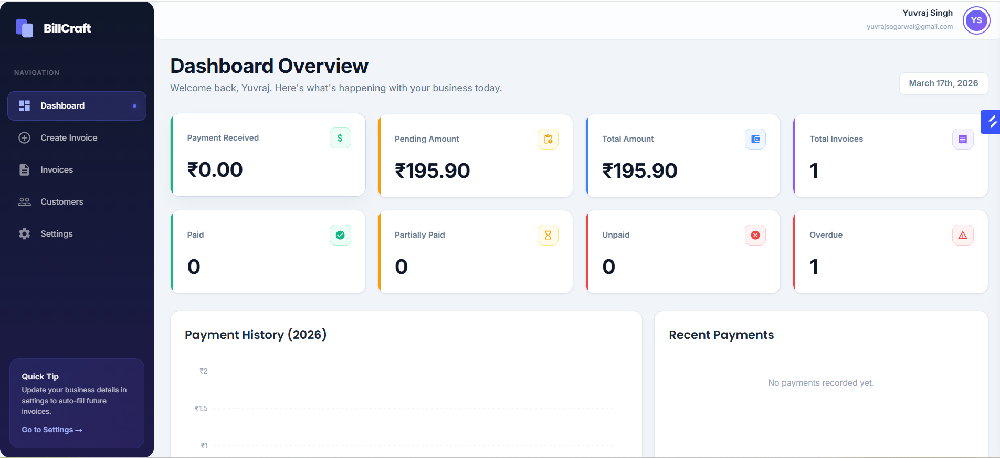
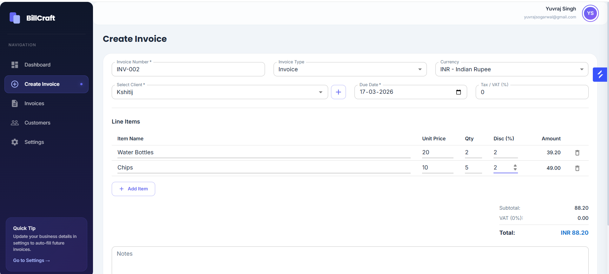
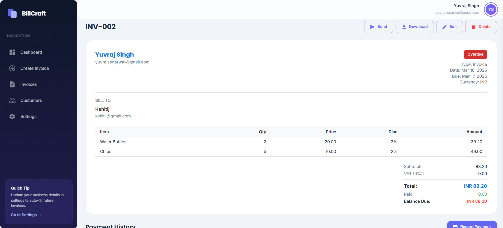
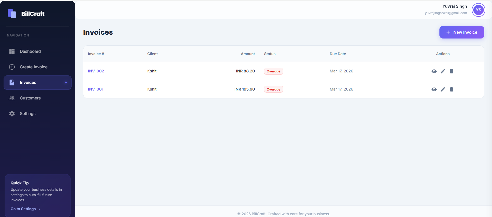
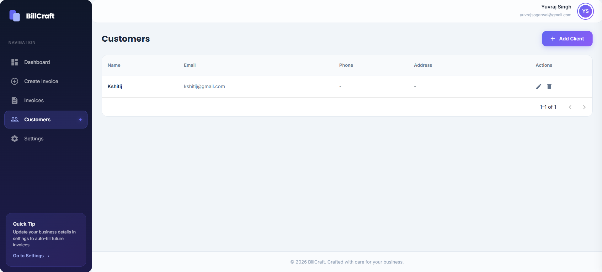

# BillCraft - Smart Invoice Management System

A full-stack invoice management platform built for freelancers and small businesses. Create professional invoices, track payments in real-time, manage clients, and gain insights through a beautiful analytics dashboard.

---

## Screenshots

### 1. Dashboard


### 2. Create Invoice Page


### 3. Invoice Page


### 4. All Invoices Page


### 5. Customers Page


---

## Tech Stack

### Frontend
- **React 18** with Vite
- **Material-UI (MUI)** - UI components
- **Redux + Redux Thunk** - State management
- **React Router v6** - Client-side routing
- **ApexCharts** - Dashboard analytics charts
- **Axios** - HTTP client
- **Notistack** - Toast notifications
- **Google OAuth** - Social login

### Backend
- **Django 4.2** with Django REST Framework
- **MongoDB** with PyMongo
- **JWT (PyJWT)** - Authentication
- **Bcrypt** - Password hashing
- **XHTML2PDF + Jinja2** - PDF generation
- **SMTP (Mailtrap)** - Email delivery

---

## Features

- **Authentication** - Email/password signup & login, Google OAuth, password reset via email
- **Invoice Management** - Create, edit, delete invoices with line items, tax, currency, and notes
- **PDF Generation** - Generate professional PDF invoices and download or email them directly
- **Payment Tracking** - Record multiple payments per invoice with auto status updates (Paid, Partial, Unpaid, Overdue)
- **Client Management** - Store and reuse client details with search and pagination
- **Dashboard Analytics** - Revenue metrics, payment charts, invoice status breakdown
- **Business Profile** - Customize business name, logo, contact info for branded invoices
- **Email Invoices** - Send invoices as PDF attachments with a branded email template

---

## Getting Started

### Prerequisites

- **Python 3.11+**
- **Node.js 18+**
- **MongoDB** (local or Atlas cloud)

### 1. Clone the Repository

```bash
git clone https://github.com/your-username/BillCraft.git
cd BillCraft
```

### 2. Backend Setup

```bash
cd server

# Create and activate virtual environment
python -m venv venv
venv\Scripts\activate        # Windows
# source venv/bin/activate   # macOS/Linux

# Install dependencies
pip install -r requirements.txt

# Configure environment variables
cp .env.example .env
# Edit .env with your MongoDB URI, JWT secret, email credentials, etc.

# Start the server
python manage.py runserver 5000
```

Backend runs at `http://localhost:5000`

### 3. Frontend Setup

```bash
cd client

# Install dependencies
npm install

# Configure environment variables
cp .env.sample .env
# Edit .env with your API URL, Google OAuth client ID, Cloudinary config

# Start the dev server
npm run dev
```

Frontend runs at `http://localhost:5173`

---

## Environment Variables

### Backend (`server/.env`)

| Variable | Description | Example |
|----------|-------------|---------|
| `SECRET_KEY` | Django secret key | `your-secret-key` |
| `DEBUG` | Debug mode | `True` |
| `MONGODB_URI` | MongoDB connection string | `mongodb+srv://...` |
| `JWT_SECRET` | JWT signing secret (32+ chars) | `your-jwt-secret` |
| `JWT_EXPIRATION` | Token expiry in ms | `43200000` (12 hours) |
| `EMAIL_HOST` | SMTP host | `sandbox.smtp.mailtrap.io` |
| `EMAIL_PORT` | SMTP port | `2525` |
| `EMAIL_HOST_USER` | SMTP username | `your-username` |
| `EMAIL_HOST_PASSWORD` | SMTP password | `your-password` |
| `FRONTEND_URL` | Frontend URL for CORS | `http://localhost:5173` |

### Frontend (`client/.env`)

| Variable | Description | Example |
|----------|-------------|---------|
| `VITE_API_URL` | Backend API URL | `http://localhost:5000` |
| `VITE_APP_URL` | Frontend app URL | `http://localhost:5173` |
| `VITE_GOOGLE_CLIENT_ID` | Google OAuth client ID | `your-client-id` |
| `VITE_CLOUD_NAME` | Cloudinary cloud name | `your-cloud-name` |
| `VITE_UPLOAD_PRESET` | Cloudinary upload preset | `your-preset` |

---

## API Endpoints

### Authentication
| Method | Endpoint | Description |
|--------|----------|-------------|
| POST | `/users/signin` | User login |
| POST | `/users/signup` | Create account |
| POST | `/users/forgot` | Request password reset |
| POST | `/users/reset` | Reset password with token |

### Invoices
| Method | Endpoint | Description |
|--------|----------|-------------|
| GET | `/invoices` | List user's invoices |
| POST | `/invoices` | Create new invoice |
| GET | `/invoices/count` | Get invoice count |
| GET | `/invoices/:id` | Get invoice details |
| PATCH | `/invoices/:id` | Update invoice |
| DELETE | `/invoices/:id` | Delete invoice |

### Clients
| Method | Endpoint | Description |
|--------|----------|-------------|
| GET | `/clients/user` | Get user's clients |
| GET | `/clients/all` | Get paginated clients |
| POST | `/clients` | Create client |
| GET | `/clients/:id` | Get client details |
| PATCH | `/clients/:id` | Update client |
| DELETE | `/clients/:id` | Delete client |

### Profiles
| Method | Endpoint | Description |
|--------|----------|-------------|
| GET | `/profiles` | Get user's profiles |
| POST | `/profiles` | Create profile |
| GET | `/profiles/:id` | Get profile details |
| PATCH | `/profiles/:id` | Update profile |
| DELETE | `/profiles/:id` | Delete profile |

### PDF & Email
| Method | Endpoint | Description |
|--------|----------|-------------|
| POST | `/send-pdf` | Generate and email invoice PDF |
| POST | `/create-pdf` | Generate PDF (cached) |
| GET | `/fetch-pdf` | Download generated PDF |
| GET | `/public/pdf/:id` | View public invoice PDF |

---

## Project Structure

```
BillCraft/
├── client/                     # React frontend
│   ├── src/
│   │   ├── actions/            # Redux actions
│   │   ├── api/                # Axios API client
│   │   ├── components/
│   │   │   ├── Dashboard/      # Analytics & charts
│   │   │   ├── Home/           # Landing page
│   │   │   ├── Invoice/        # Invoice CRUD & details
│   │   │   ├── Login/          # Auth pages
│   │   │   ├── Clients/        # Client management
│   │   │   ├── Settings/       # Business profile
│   │   │   ├── NavBar/         # Sidebar navigation
│   │   │   └── Footer/         # Footer component
│   │   ├── constants/          # Action types
│   │   ├── reducers/           # Redux reducers
│   │   ├── utils/              # Helper functions
│   │   ├── App.jsx             # Main routing
│   │   └── main.jsx            # Entry point
│   ├── index.html
│   └── package.json
│
├── server/                     # Django backend
│   ├── billcraft/              # Main Django app
│   │   ├── users/              # Auth endpoints
│   │   ├── invoices/           # Invoice endpoints
│   │   ├── clients/            # Client endpoints
│   │   ├── profiles/           # Profile endpoints
│   │   ├── pdf/                # PDF generation & email
│   │   ├── templates/          # HTML templates (PDF, email)
│   │   ├── settings.py         # Django configuration
│   │   ├── urls.py             # URL routing
│   │   ├── db.py               # MongoDB connection
│   │   ├── auth_middleware.py   # JWT authentication
│   │   └── wsgi.py
│   ├── manage.py
│   ├── requirements.txt
│   └── .env.example
│
├── screenshots/                # App screenshots
└── README.md
```

---

## License

This project is open source and available under the [MIT License](LICENSE).
